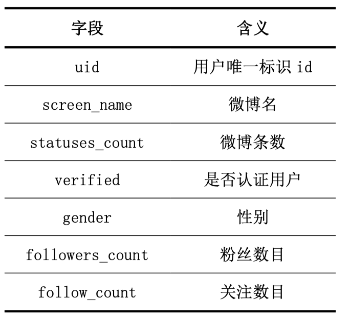
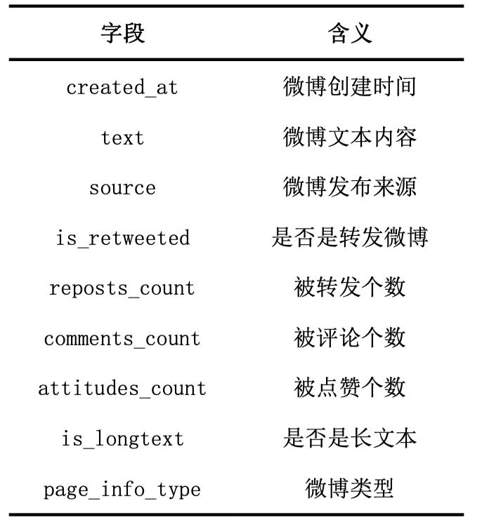
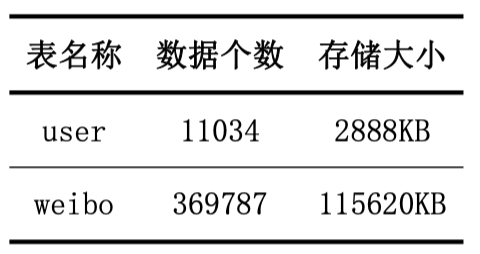

# 微博分布式爬虫（一天爬取30万数据）

> 注意：
>
> - 使用本爬虫，作者默认您已经了解 Scrapy、MongoDB、Redis的基本知识。
> - 熟练的同学可以通过修改源码自定义需要爬取的数据

基于Scrapy 和 Scrapy-redis 的分布式微博爬虫项目。

使用了 ip 代理池库 Scylla，每30个请求切换一次代理ip，防止出现验证码和访问频繁的提示。

需要安装的库有：

[Scylla](https://github.com/imWildCat/scylla)、Scrapy、Scrapy-redis、pymongo

需要配置数据库 MongoDB 和 Redis 到服务器端电脑，具体使用方法请自行了解。

本分布式爬虫可以爬取到的数据如下图所示：

由于具有爬取时间延迟设置（防止被屏蔽），因此花费了24小时左右的时间，爬取到的数据量如下：

可以在**weiboRedisSpider/settings.py**配置文件中个性化配置自己的需求：

例如：

- User-Agent 的配置
- 限制微博的时间，比这个日期更老的微博就不抓取了
- 代理获取间隔，每个多少个请求获取一次ip代理，控制获取代理的速度，减少获取代理等待的时间
- 爬虫所运行的主机的名字，用于多台电脑同时爬取时，区分数据是哪台电脑爬取的

具体的配置请参考 settings.py 的配置文件。

在使用中遇到任何问题，可以联系我，很乐意一起讨论解决问题。

企鹅号码（需 base64解密）：NTk1Njk2OTYw